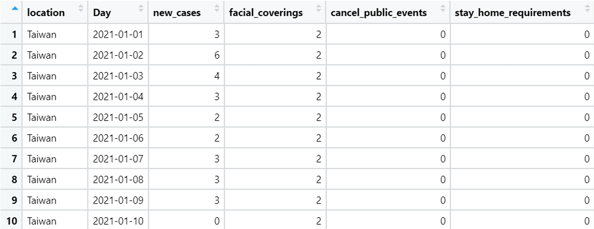
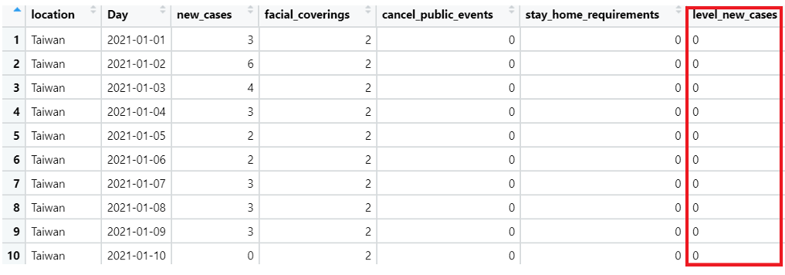
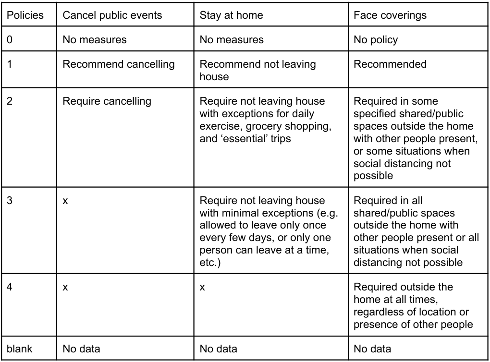
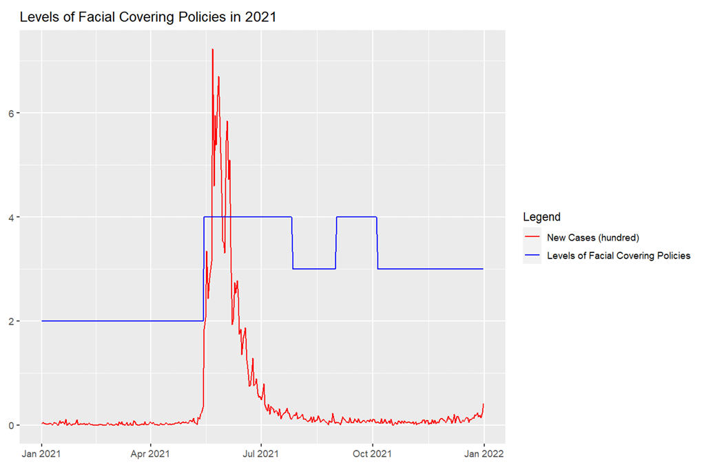
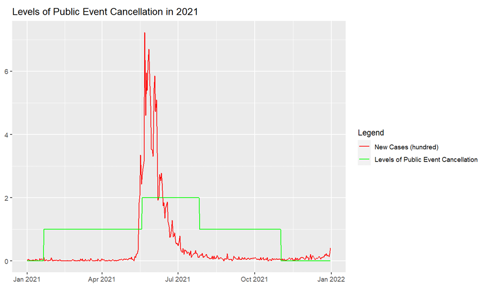
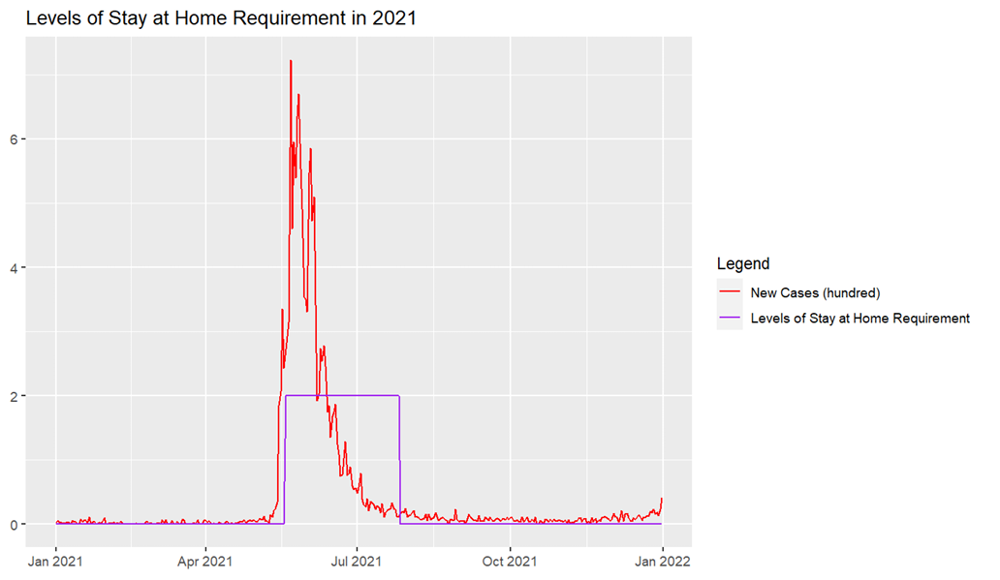
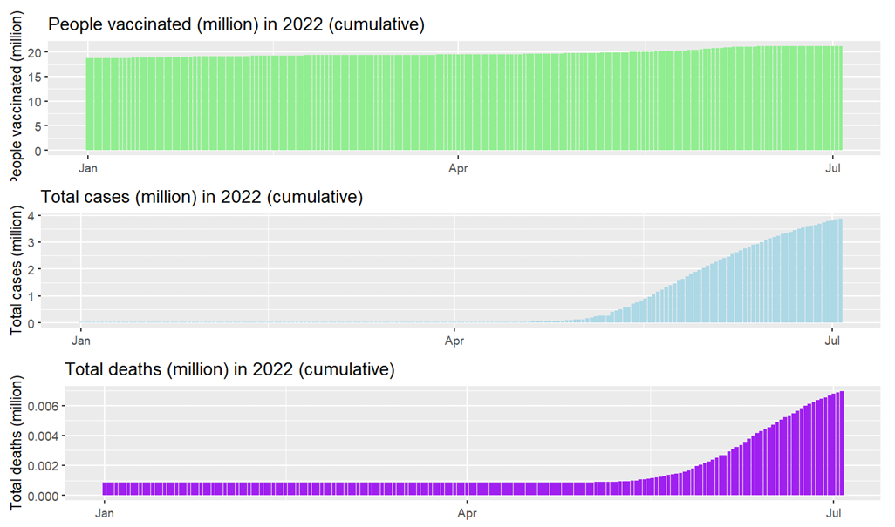
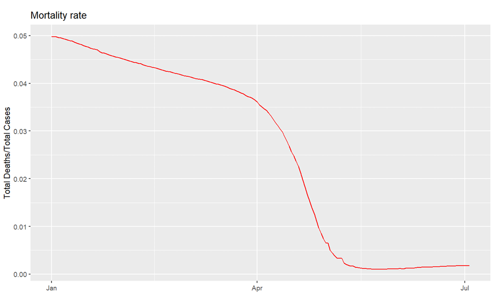

# Findings

## Overview
This project explored whether government policy intensity was associated with COVID-19 case trends in Taiwan, and whether mortality risk declined after vaccination coverage increased.

---

## Data Snapshot

The merged 2021 dataset combined daily new cases with three policy indicators:
- face covering policies
- public event cancellation
- stay-at-home requirements

To run the Chi-square test, `new_cases` was converted into a categorical variable called `level_new_cases`.

The policy levels used in this project are summarized below.

---

## Statistical Result

### Chi-square test
All three policy variables showed a statistically significant association with case severity in 2021:

- **Face coverings**: X² = 90.402, p < 0.001
- **Public event cancellation**: X² = 119.69, p < 0.001
- **Stay-at-home requirements**: X² = 119.33, p < 0.001

### Interpretation
The null hypothesis was rejected in all three tests.  
This suggests that policy intensity and COVID-19 case severity were significantly related in the 2021 Taiwan dataset.

---

## Key Findings

### 1. Face covering policies tightened during the 2021 outbreak peak
The chart below shows that new cases surged around May 2021, and face covering rules were raised from a moderate level to the strictest level.

**Takeaway:** mask policy became stricter as outbreak severity increased.

---

### 2. Public event restrictions were strengthened temporarily
Public event cancellation policies became stricter during the outbreak peak, but the restriction period was relatively short and later returned to a lower level.

**Takeaway:** Taiwan responded with short-term restrictions rather than prolonged shutdowns.

---

### 3. Stay-at-home requirements were also tightened during the surge
Stay-at-home restrictions increased after the May 2021 outbreak, then gradually relaxed as conditions improved.

**Takeaway:** Taiwan followed a responsive **soft lockdown** pattern instead of maintaining long-term severe restrictions.

---

### 4. Vaccination increased substantially in 2022
The 2022 cumulative charts show strong vaccination growth, alongside rising total cases and total deaths.

**Takeaway:** although infections increased sharply in 2022, vaccination coverage also rose to a high level.

---

### 5. Mortality rate declined sharply in 2022
The mortality rate chart shows that `total_deaths / total_cases` fell significantly after April 2022 and stayed at a relatively low level afterward.

**Takeaway:** even though total cases rose, severe outcomes became relatively less frequent after vaccination expanded.

---

## Final Insight

Overall, the findings suggest that:

- government policy intensity was significantly associated with case severity in 2021
- Taiwan used a **responsive, moderate restriction strategy**
- after vaccination scaled up, mortality risk declined even though case volume increased

This project supports the idea that **targeted policy tightening plus vaccination rollout** can help control epidemic impact without relying on prolonged hard lockdowns.
